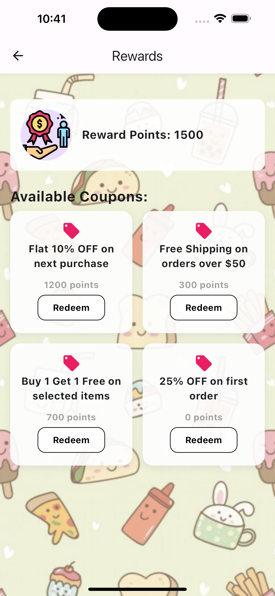

# What's in My Food Project Prototype

"What’s in My Food" is an AI-powered app designed to empower Indian consumers with transparency about food safety. It scans and analyzes food labels, identifying harmful ingredients, allergens, and regulatory non-compliance, enabling informed dietary decisions.

## Problem Statement 

As health consciousness rises globally, Indian consumers are increasingly demanding transparency about the ingredients in their food. However, the Indian market often lacks accountability, exposing consumers to harmful ingredients like allergens, unsafe additives, and banned substances.

With the increasing prevalence of food-related health issues, there’s an urgent need for a reliable solution to identify harmful ingredients and allergens in food products. Existing solutions in the market, like Sift, Yuka, and Fooducate, primarily cater to US markets and focus on lifestyle features like weight loss or cosmetic products.

Key Issues Identified:

  * India-specific concerns, including unsafe food additives and allergens.
  * Limited personalization options in existing apps.
  * Static databases without real-time updates or AI-driven insights.
  * Lack of security focused apps prioritizing consumer safety over lifestyle features.

## Project Vision 
To empower Indian consumers to make informed decisions about their diet and health by providing a transparent, AI-driven food analysis app.

## Key Features

1. Health Risk Alerts: Flags allergens, unsafe additives, and banned substances.
2. Personalization: Tailors insights to individual sensitivities (e.g., gluten intolerance).
3. Nutritional Analysis: Highlights products exceeding dietary guidelines.
4. Simple Scoring: Alphabetical gradings for easy understanding.
5. Blockchain Backed Rewards System to keep users coming back!

## Prototype Preview
Below is the UI of our app, showcasing the user flow and key features.

  
  
  
  
  
  
  
  
  
  
  
  
  
  
  
  

1️⃣ Login & Sign-Up Flow

The first screen presents the Login/Sign-Up page. If a user does not have an account and clicks on Sign Up, they are redirected to a survey. The survey collects basic information, including:

Food allergies (affecting 20-25% of the Indian population).

Health conditions impacting dietary needs.

Dietary preferences (Vegetarian, Keto, etc.).

After survey completion, the Login screen reappears for user authentication.

2️⃣ Scanning & Product Analysis

Once logged in, users can navigate through the app. The top two buttons enable:

Ingredient Scanning (OCR-based analysis).

Barcode Scanning (Product identification & analysis).

Both features are functional, with recorded demos available in our Google Drive:

🔗 [View Recorded Outputs](https://drive.google.com/drive/u/0/folders/1A4lO2ma5NU2Ual3tCSV8KYAV5ic0EVfk)

3️⃣ Search & Product Lists

Users can manually search for products via the Search Bar.

The app includes:

Shopping List (for purchasing items, integrated for affiliate marketing).

EatList (tracking dietary choices).

4️⃣ Research & Blogs

A Research Papers section is integrated into the Home Screen for users curious about the scientific backing behind the app’s development. The Blogs Page provides additional insights and health-related content.

5️⃣ Premium Features (Future Roadmap)

Two screens highlight features exclusive to the Premium Plan, which will be added in future updates.

6️⃣ Profile & Additional Features

The final screen is the Profile Page, allowing users to manage their settings and preferences.

📌 Backend & Chatbot Functionality

For details on backend operations and chatbot integration, refer to our Google Drive videos.

📂 [View Demo Videos & Backend Work](https://drive.google.com/drive/u/0/folders/1A4lO2ma5NU2Ual3tCSV8KYAV5ic0EVfk)

